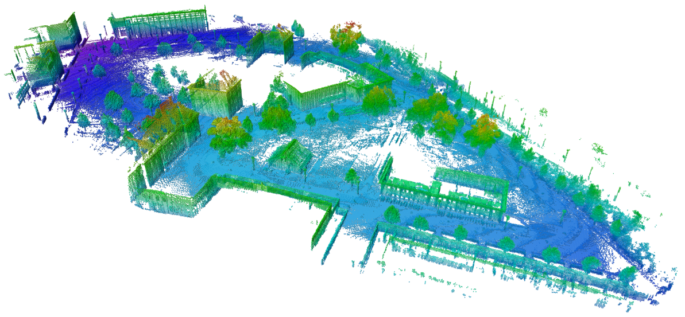

## About
---

 

I am a Master of Science student in Electrical and Computer Engineering at the Georgia Institute of Technology graduating in December, 2020. My research interests include computer vision, localization and mapping, and 3D perception with a specific interest in autonomous driving applications.   
I am currently working with Robotics Perception and Learning Lab, developing a framework that accounts for uncertainites while developing costmaps for sematic segmentation. In the past, I took special problem to develop extended kalman filter based Visual SLAM system.  
In terms of experience, I have recently completed Mapping and Localization Software Engineer Co-op at Torc Robotics  where I contributed to development and deployment of 3D maps. Before starting my masters at Georgia Institute of Technology, I was working at Optum, a United Health Group subsidary as a Associate Software Engineer where I was reponsible for developing and enhancing APIs to allow provider, facilities and payers to manage the claim lifecycle.    

<!-- For more information, see my [CV](/pdf/Resume_Anjali_Dhabaria.pdf) -->

## Experience
---

### Mapping and Localization Software Engineer Co-op, Torc Robotics

 
Worked on 3D reconstruction and mapping using point clouds from LiDAR.    

### Associate Software Engineer, Optum

## Projects
---
### Robotics Perception and Learning Lab:

### Data Augmentation using Reinforcement Learning:

### Real-time Scene Understanding using ENet:

### Visual Simultaneous Localization and Mapping:

### Style Transfer:

### Leader-based SLAM for search and rescue: